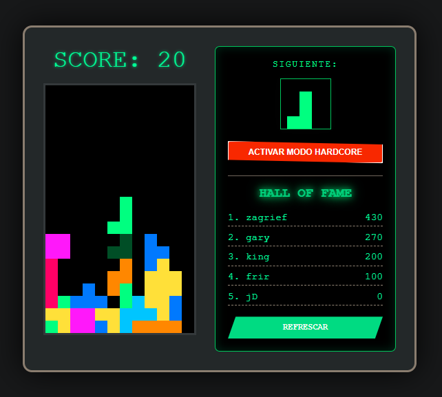
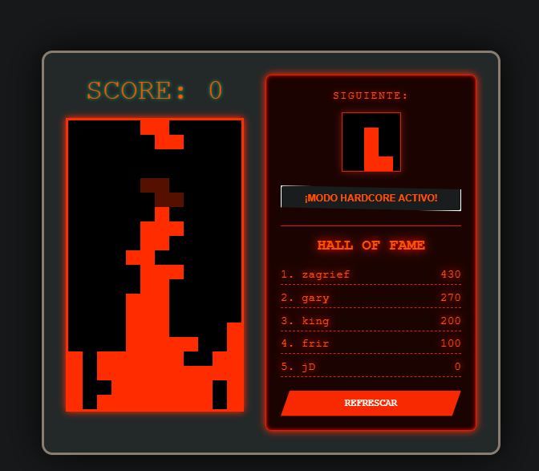

# 🕹️ Tetris Neón - Hardcore Edition

¡Bienvenido a **Tetris Casual**! Una versión moderna y estilizada del clásico juego de piezas, diseñada con una estética retro neón y un desafío extremo .

## 📸 Previsualización

| Modo Normal | Modo Hardcore |
| :---: | :---: |
|  |  |

## 🚀 Características Especiales

*   **Estética Neón:** Interfaz visual limpia en verde neón y negro.
*   **Sistema de Partículas:** Explosiones de luz al completar líneas.
*   **Efecto Shake:** Vibración dinámica de la pantalla al hacer *Hard Drops*.
*   **Hall of Fame:** Sistema de ranking local persistente (vía PHP/JSON).
*   **🔥 MODO HARDCORE:** 
    *   Cambio total de estética a "Fuego Naranja".
    *   Velocidad de caída extrema (150ms).
    *   Efectos de brillo y resplandor en toda la interfaz.

## 🎮 Cómo Jugar

| Tecla | Acción |
| :--- | :--- |
| `←` / `→` | Mover pieza |
| `↑` | Rotar pieza |
| `↓` | Caída suave |
| `Espacio` | **Hard Drop** (Caída instantánea con vibración) |
| **Botón** | Alternar Modo Hardcore |

## 🛠️ Instalación local

1. Clona el repositorio.
2. Usa un servidor local (XAMPP/Laragon) para que el sistema de puntos (PHP) funcione.
3. Abre `index.php` en tu navegador.

## 📜 Licencia
Este proyecto está bajo la Licencia MIT.
